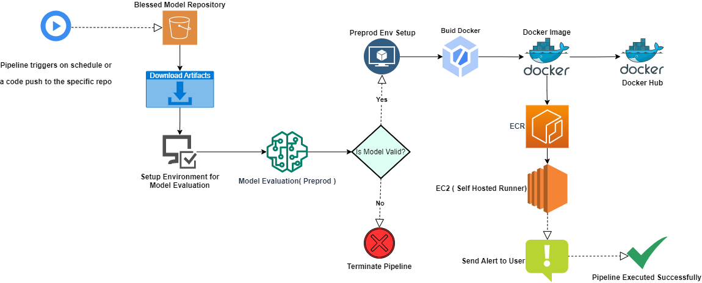
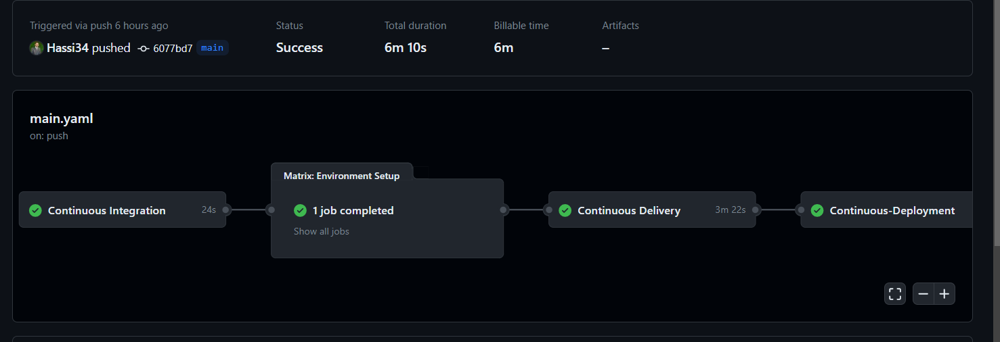

<p align="center">
    <b>
        <h1 align="center">NLP Hub</h1>
    </b>
</p>
<p align="center">
<a href="https://github.com/Hassi34/NLP-Hub">
    
</a>
</p>
<p align="center">
<a href="https://github.com/Hassi34/NLP-Hub">
    
</a>
</p>

<p align="center">
    <a href="https://www.python.org/downloads/">
        
    </a>
    <a href="https://github.com/Hassi34/NLP-Hub">
        
    </a>
    <a href="https://github.com/Hassi34/NLP-Hub">
        
    </a>
    <a href="https://github.com/Hassi34/NLP-Hub">
        
    </a>
    <a href="https://github.com/Hassi34/NLP-Hub">
        
    </a>
    <a href="https://github.com/Hassi34/NLP-Hub/blob/main/LICENSE">
        
    </a>
    <a href="https://github.com/hassi34/NLP-Hub/issues">
        
    </a>
    <a href="https://github.com/hassi34/NLP-Hub/issues">
        
    </a>
</p>

Following are the main contents to follow, you can jump to any section:

>   -  [Introduction](#project-intro)<br>
>   -  [Description](#project-description)<br>
>   -  [Project Notebooks](https://github.com/Hassi34/BERT-NER-Fine-tuning/tree/notebooks)
>   -  [Tech Stack](#tech-stack)<br>
>   -  [Infrastructure](#infra-)<br>
>   -  [Run Locally](#run-local)<br>
>      - [Environment Setup](#env-setup)<br>
>      - [Setup Self Hosted Runner](#self-hosted)<br>
>      - [Environment Variables](#env-vars)<br>
>      - [Start CICD](#start-cicd)<br>
>      - [REST API with Docker](rest-api)<br>
>        - [Pull Image from Docker Hub](#docker-container)<br>
>        - [Docker Container](#docker-container)<br>
>   -  [Conclusion](#conclusion-)<br>

## System Design


## CICD on Circleci

## Introduction<a id='project-intro'></a>
Natural Language Processing (NLP) has become an essential technology in various industries, including healthcare, finance, marketing, and customer service. NLP techniques enable computers to understand, analyze, and generate human language, making it possible to automate tasks such as sentiment analysis, named entity recognition, grammer & spell check, and text summarization.

This project aims to develop a production-grade system that offers multiple NLP services, leveraging the power of GitHub Actions for continuous integration and continuous deployment (CI/CD), and AWS ECR (Elastic Container Registry) for container image management. The system will be deployed on EC2 self-hosted runners, providing an efficient and scalable solution for delivering high-quality NLP services.
### Description<a id='project-description'></a>
The NLP Hub consists of multiple NLP services, each providing a specific functionality, such as sentiment analysis, named entity recognition, grammer & spell check, and text summarization. The system will be designed to handle a high volume of text data.

The system will be containerized using Docker, allowing for easy deployment and scaling. Docker images will be built and pushed to AWS ECR, a fully managed container registry service provided by AWS, which provides a secure and scalable way to store and manage Docker container images. AWS ECR will be used for image management and versioning, enabling seamless deployment of new versions of the containers.

The CI/CD pipeline will be implemented using GitHub Actions, which will be triggered automatically whenever changes are pushed to the GitHub repository. GitHub Actions will build the Docker images, run tests, and push the images to AWS ECR. Then, the images will be pulled from ECR and deployed on EC2 self-hosted runners, which are EC2 instances configured as GitHub Actions runners. These runners will handle the deployment of the containers, ensuring a smooth and automated CI/CD process.

## Tech Stack Used<a id='tech-stack'></a>
1. Python 
2. Docker
3. Deep Learning
4. PyTorch
5. Hugging Face
6. Cloud Computing
7. SMTP Server

## Infrastructure<a id='infra-'></a>

1. GitHub
2. DockerHub
3. S3 Bucket
4. GitHub Actions
5. Amazon ECR (Elastic Container Registry)
6. EC2 (Self Hosted Runner)

## Run Locally<a id='run-local'></a>

* Ensure you have [Python 3.7+](https://www.python.org/downloads/) installed.

* Create a new Python Conda environment:<a id='env-setup'></a>

```bash
conda create -n venv python=3.10  
conda activate venv 
```
OR
* Create a new Python virtual environment with pip:
```bash
virtualenv venv
source venv/Scripts/activate
```
Install dependencies

```bash
  pip install -r requirements.txt
```

Clone the project

```bash
  git clone https://github.com/Hassi34/NLP-Hub.git
```

Go to the project directory

```bash
  cd NLP-Hub
```
## Setup Self Hosted Runner<a id='self-hosted'></a>
Provision an EC2 instance and run the following commands in order:
optinal commands
```bash
sudo apt-get update -y
sudo apt-get upgrade
```
required commands
```bash
curl -fsSL https://get.docker.com -o get-docker.sh
sudo sh get-docker.sh
sudo usermod -aG docker ubuntu
newgrp docker
```

## Export the environment variable<a id='env-vars'></a>
```bash
AWS_ACCESS_KEY_ID=""
AWS_SECRET_ACCESS_KEY=""
AWS_REGION=""

#DockerHub 
DOCKERHUB_ACCESS_TOKEN=""
DOCKERHUB_USERNAME=""
IMAGE_NAME_DOCKER_HUB=""

#Email Alerts
EMAIL_PASS=""
SERVER_EMAIL=""
EMAIL_RECIPIENTS=""

#Applicable to Actions only
AWS_ECR_LOGIN_URI=""
ECR_REPOSITORY_NAME=""

```
To run CICD, make sure to setup the above environment variables as the secrets in GitHub Actions

## Start CICD<a id='start-cicd'></a>
First setup a self-hosted runner on GitHub then create a GitHub repository and push the code to the main branch
```bash
  git add . && git commit -m "first commit" && git push -u origin main
```
## REST API with Docker<a id='rest-api'></a>
To run the following command sequence, ensure you have the docker installed on your system.

### Pull Image from Docker Hub<a id='docker-pull'></a>
In case you have not already pulled the image from the Docker Hub, you can use the following command:
```bash
docker pull hassi34/nlp-hub
```

### Docker Container<a id='docker-container'></a>
Now once you have the docker image from the Docker Hub, you can now run the following commands to test and deploy the container to the web

* Run a Docker Container<a id='run-docker-container'></a><br>
Check all the available images:
```bash
docker images
```
Use the following command to run a docker container on your system:
```bash
docker run --name <CONTAINER NAME> -p 80:8080 -d <IMAGE NAME OR ID>
```
Check if the container is running:
```bash
docker ps
```
If the container is running, then the API services will be available on all the network interfaces<br>
To access the API service, type **``localhost``** in the browser.
## Conclusion<a id='conclusion-'></a>
In conclusion, this project aims to develop a production-grade NLP services system with CI/CD implemented using GitHub Actions and AWS ECR. The system will be scalable, secure, and highly available, and it will provide multiple NLP services to cater to different use cases. The project will leverage the power of NLP libraries, containerization, and container image management using AWS ECR, along with GitHub Actions and EC2 self-hosted runners, to deliver a robust and efficient solution for NLP applications.
#### **Thank you for visiting 🙏 Your feedback would be highly appreciated 💯😊**<br>
#### **If you find this project useful then don't forget to star the repo ✨⭐🤖**<br>
#### 🌏[My Portfolio Website][website] <br><br>
#### **📃 License**
[MIT][license] © [Hasanain][website]

[license]: hhttps://github.com/Hassi34/NLP-Hub/blob/main/LICENSE
[website]: https://hasanain.aicaliber.com

Let's connect on **[``LinkedIn``](https://www.linkedin.com/in/hasanain-mehmood)** <br>